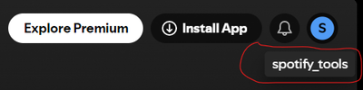
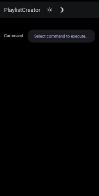
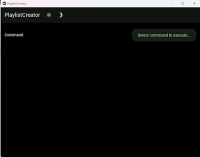

# Spotify tools
This repository contains set of automation tools for Spotify library.

## Playlist creator
Allows to create playlists from:
- user's top
- recommendations based on user's top
- 2 playlists belonging to 2 users

Packed into KivyMD app (i.e. cross-platform). Available as ready apk file for Android and exe for Windows.

### Usage
#### Android
The app is still in development mode which means that any new user has to be added into Spotify developer's dashboard in order to allow it to be authenticated with my app. If you wish to use the app, send [email](playlist.creator@outlook.com) with your Spotify name (see screenshot below to get an idea where to get it) and email associated with your Spotify account so that I'll add you to the dashboard.

1. Download apk from `data` branch.
2. Upload apk on your Android device.
3. Allow installation from unknown sources.
4. Run **Playlist Creator**.
5. Accept authentication request on Spotify page.
6. Go back to the app.

You should see easy and straight-forward interface like this:

> N.B.: newly created playlist might not show up in Spotify app (there is number of questions in the Internet regarding this) while it's shown in web player. The solution here is to go to Settings -> Data-saving and offline -> Offline mode (toggle ON), wait for at least 20 minutes then go back online. Spotify will sync the library. If it doesn't help try cleaning up Spotify cache.

#### Windows
1. Download exe from `data` branch.
2. Run it as usual.
3. Accept authentication request on Spotify page.
4. Go back to the app.

You should see familiar interface:

### Bug reporting and feature requests
If you stumble upon something you believe is a bug, feel free to create an issue in this repository describing your use case.

If there is some good idea for an improvement, feel free to create an issue in this repository describing what you'd like to see implemented.

---
## Migrator
(outdated console script for migrating user's library from YouTube music to Spotify)

For successful using of this script you should create headers.json by the following steps:
1) authenticate in Youtube music
2) get headers from authenticated Youtube music GET requests
3) place the following headers to headers.json:
  - Authorization
  - Cookie
  - x-origin
For a full information please read the documentation: https://ytmusicapi.readthedocs.io/en/latest/setup.html

And also you should create Spotify config.json with the following keys:
- client_id
- client_secret
- redirect_uri: you can use http://localhost:8888/callback for local script execution
- scope: as space-separated string. This script requires the followings:
  user-library-modify user-library-read playlist-read-private playlist-modify-private user-top-read user-read-email user-read-private
For a full information please read the documentation: https://developer.spotify.com/documentation/general/guides/app-settings/, https://developer.spotify.com/documentation/general/guides/scopes/
